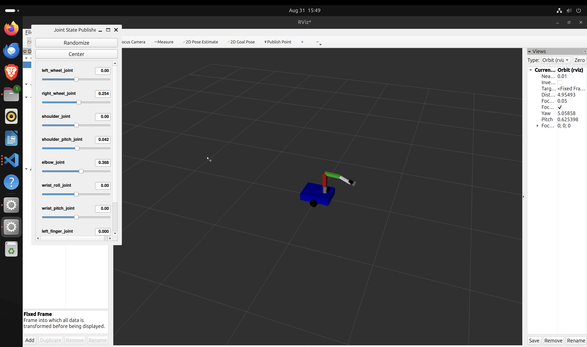

# PickPlace RL Mobile Robot

This is a deep reinforcement learning environment built on top of ROS2 (Humble) and Gazebo Harmonic to train a mobile pick and place robot using Stable Baselines 3 (SAC).

## Previews
Here is a screenshot of the trained environment inside Gazebo:



## Installation
First, build the workspace to register the ROS2 nodes:
```bash
colcon build --packages-select pickplace_rl_mobile
source install/setup.bash
```

## Running the Training Agent
To start the training loop from scratch, simply run the standalone launch file:
```bash
ros2 launch pickplace_rl_mobile standalone_rl_training.launch.py
```
This will automatically launch Gazebo with the `pickplace_world.world`, spawn the `pickplace_robot`, and link the controllers via `ros_gz_bridge`. It will finally run the SAC-based RL agent script `train_rl.py`.
