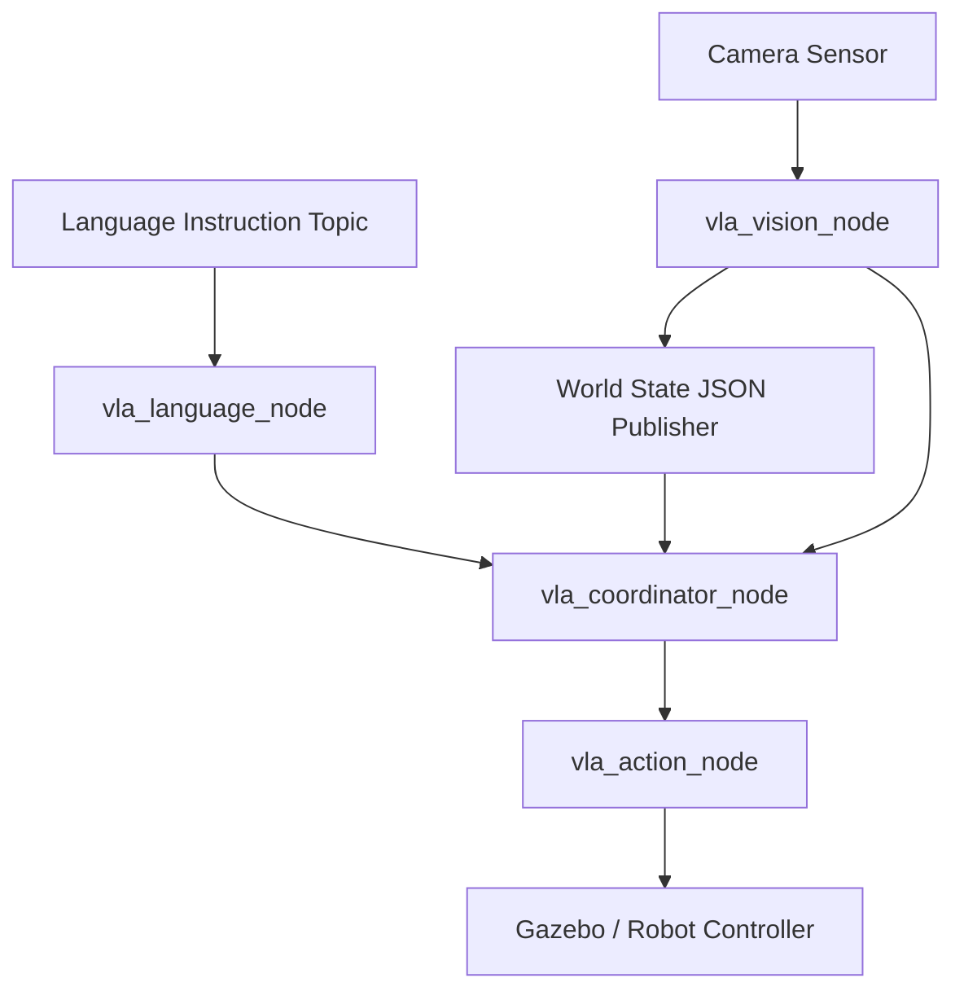

# Vision Language Action (VLA) Concepts and Architecture

## 1. Core Principles of VLA
A Vision Language Action (VLA) system connects three domains:
* **Vision**: Perception from a camera or depth sensor
* **Language**: Natural language understanding and parsing
* **Action**: Robot control, path planning, and physical execution

The system maps a tuple of `(Image, Instruction)` to a `Robot Action`.

## 2. System Architecture Design
To maintain reliability and extensibility in ROS 2, the system uses a modular pipeline instead of a monolithic end-to-end model. We have implemented this inside the `pickplace_rl_mobile` package:

1. **Vision Node (`vla_vision_node.py`)**: Converts raw camera feeds into 3D object poses using OpenCV HSV color segmentation. It computes the centroid, merges depth data, and publishes `geometry_msgs/PoseStamped` objects, as well as a JSON string containing the global tracking states of known colored objects.
2. **Language Parser Node (`vla_language_node.py`)**: Converts free-form text instructions (e.g., "Pick the blue cube") into structured JSON commands. We initially implemented this via Regex/Rule-based Natural Language Processing to make it deterministic without API dependencies.
3. **Task Planner/Coordinator Node (`vla_coordinator_node.py`)**: Takes the structured intent from the Language Node and looks up coordinates from the Vision Node. It orchestrates the sequence of high-level actions by communicating with the Action Node.
4. **Action Execution (`vla_action_node.py`)**: The low-level motion planning and controller execution in the Gazebo simulation utilizing MoveIt2 APIs.

### Pipeline Flow

### Hardware and Models Used
- **Camera Configuration**: The Vision node relies on the `/camera/image_raw` and `/camera/depth` ROS 2 topics. In our Gazebo simulation, these are generated by an simulated depth camera perfectly matching the specs of an **Intel RealSense D435** RGB-D camera attached rigidly to the mobile base `chassis_link`.
- **Mobile Manipulator Robot**: Instead of running navigation on one URDF and manipulation on another, we built a single unified model named `mobile_ur3.urdf`.
    - It combines the differential drive wheels and LiDAR of the ground robot with the full 6-DOF kinematics of the UR3 arm.
    - The `base_link` of the UR3 arm is rigidly attached to `chassis_link` via a fixed joint.
    - The MoveIt2 `mobile_ur3.srdf` and kinematics engines are fully aware of the mobile cart boundaries beneath the arm, guaranteeing collision-free operation when reaching for objects.

## 3. Implemented Features
We successfully built out all 4 phases of integration onto the Custom Mobile UR3 Manipulator:
* **Phase 1**: Basic Pick and Place in Gazebo. Created the `vla_action_node.py` trigger interface.
* **Phase 2**: Vision integration. Created `vla_vision_node.py` doing OpenCV pin-hole back-projection from camera frame.
* **Phase 3**: Language parsing integration. Created `vla_language_node.py` transforming strings to target intent.
* **Phase 4**: Full VLA Pipeline Orchestration. The `vla_coordinator_node.py` ties everything together. We created a singular `vla_full_pipeline.launch.py` to start them all up.

## 4. Why Modular Over End-To-End?
While cutting-edge models (RT-1, RT-2) train giant multimodal transformers to emit action tokens directly, they require massive datasets, compute, and are hard to debug. A modular pipeline allows us to:
* Individually verify perception accuracy using RViz.
* Test language parsing without moving a physical robot.
* Swap out classical CV for Deep Learning (YOLOv8) without changing the motion planner.
* Maintain deterministic safety bounds through the `safety_guard` node.
