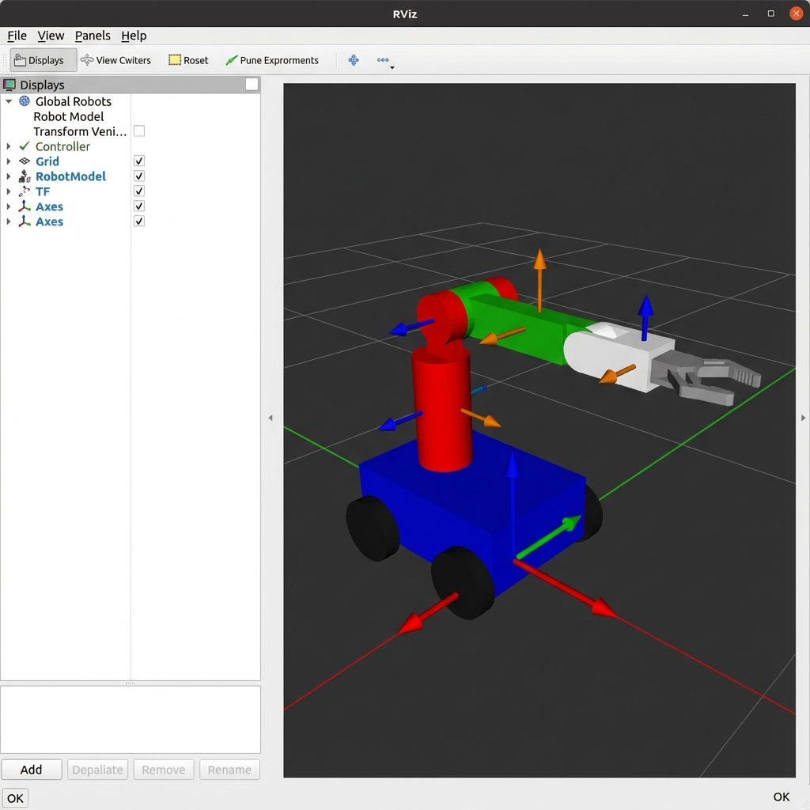

# Pick-and-Place RL Mobile Robot

## Overview
The **Pick-and-Place RL Mobile Robot** is a ROS 2 Jazzy-based project that integrates a mobile robotic base and a 4-DOF robotic arm. The system uses **Reinforcement Learning (RL)** with the SAC (Soft Actor-Critic) algorithm to autonomously pick objects from a bin and place them at a target location.

This project combines multiple robotics concepts:
- Mobile navigation with differential drive
- 4-DOF robotic arm manipulation
- Parallel gripper for grasping
- RL-based policy learning with Stable-Baselines3
- ROS 2-based modular architecture
- Gazebo simulation with physics
- URDF robot modeling and visualization

The goal is to create an end-to-end autonomous mobile manipulator capable of performing pick-and-place tasks in simulated environments.

---

## Features

### 1. Mobile Manipulator
- Differential drive mobile base with wheel encoders
- 4-DOF robotic arm (shoulder pan, shoulder pitch, elbow, wrist pitch)
- Parallel gripper with prismatic fingers for grasping
- RGB-D camera for perception

### 2. Reinforcement Learning
- **Algorithm**: SAC (Soft Actor-Critic) for continuous control
- **Environment**: Custom Gymnasium environment with ROS 2 integration
- **Observation Space**: Joint positions, end-effector position, object position, grasp state
- **Action Space**: Joint velocities + gripper control
- **Reward Shaping**: 
  - Approaching object: distance reduction rewards
  - Grasping: bonus for successful grasp
  - Transport: rewards for moving object to target
  - Placement: large bonus for successful placement
  - Smoothness penalty: encourages smooth motions

### 3. Simulation
- **Gazebo Classic**: Full physics simulation
- **World**: Custom environment with object bin and target zone
- **Plugins**: Differential drive controller, camera sensor, joint state publisher
- **Pickable Objects**: Dynamic cubes for pick-and-place tasks

---

## Directory Structure

```
pickplace_rl_mobile/
├── src/pickplace_rl_mobile/
│   ├── config/
│   │   ├── robot_view.rviz          # RViz configuration
│   │   └── training_config.yaml     # RL training hyperparameters
│   ├── launch/
│   │   ├── display_launch.py        # RViz visualization launch
│   │   └── gazebo_launch.py         # Gazebo simulation launch
│   ├── pickplace_rl_mobile/
│   │   ├── __init__.py
│   │   ├── pickplace_env.py         # Gymnasium RL environment
│   │   ├── train_rl.py              # RL training script
│   │   └── test_policy.py           # Policy evaluation script
│   ├── urdf/
│   │   └── pickplace_mobile_arm.urdf # Robot description
│   ├── worlds/
│   │   └── pickplace_world.world    # Gazebo world file
│   ├── CMakeLists.txt
│   ├── package.xml
│   └── setup.py
└── readme.md
```

---

## Prerequisites

### System Requirements
- **OS**: Ubuntu 22.04 or later
- **ROS 2**: Jazzy Jalisco (or Humble/Iron)
- **Python**: 3.10+
- **Gazebo**: Gazebo Classic 11

### ROS 2 Dependencies
```bash
sudo apt update
sudo apt install -y \
  ros-jazzy-gazebo-ros-pkgs \
  ros-jazzy-robot-state-publisher \
  ros-jazzy-joint-state-publisher \
  ros-jazzy-joint-state-publisher-gui \
  ros-jazzy-rviz2 \
  ros-jazzy-xacro
```

### Python Dependencies
```bash
pip install gymnasium stable-baselines3 torch numpy
```

---

## Installation & Build

### 1. Clone the Repository
```bash
cd ~/
git clone https://github.com/darshmenon/pickplace-rl-mobile.git
cd pickplace-rl-mobile
```

### 2. Build the Workspace
```bash
colcon build --packages-select pickplace_rl_mobile
source install/setup.bash
```

### 3. Verify Installation
```bash
ros2 pkg list | grep pickplace_rl_mobile
```

---

## Usage

### Visualization in RViz (No Simulation)
View the robot model interactively:
```bash
source install/setup.bash
ros2 launch pickplace_rl_mobile display_launch.py
```
- Use the joint sliders to move the robot
- Visualize the robot structure and transforms

### Gazebo Simulation
Launch the full Gazebo simulation:
```bash
source install/setup.bash
ros2 launch pickplace_rl_mobile gazebo_launch.py
```
This will:
- Start Gazebo with the custom world
- Spawn the robot at the origin
- Show the object bin and target zone
- Display a pickable red cube in the bin

---

## Training the RL Agent

### Quick Start Training
Train for 100k timesteps (recommended for testing):
```bash
source install/setup.bash

# In terminal 1: Launch Gazebo
ros2 launch pickplace_rl_mobile gazebo_launch.py

# In terminal 2: Start training
ros2 run pickplace_rl_mobile train_rl --timesteps 100000 --save-dir ./rl_models
```

### Training Parameters
- `--timesteps`: Total training steps (default: 100000)
- `--save-dir`: Directory to save model checkpoints (default: ./rl_models)

### Monitoring Training
- **Checkpoints**: Saved every 10,000 steps in `rl_models/`
- **Evaluation**: Runs every 5,000 steps
- **TensorBoard**: Logs saved to `rl_models/tensorboard/`

View training progress:
```bash
tensorboard --logdir ./rl_models/tensorboard
```

---

## Testing the Trained Policy

After training, test the learned policy:
```bash
source install/setup.bash

# Launch Gazebo
ros2 launch pickplace_rl_mobile gazebo_launch.py

# In another terminal, test the policy
ros2 run pickplace_rl_mobile test_policy --model ./rl_models/pickplace_final_model.zip --episodes 5
```

The test script will:
- Load the trained model
- Run multiple episodes
- Display success rate and average reward
- Print end-effector and object positions

---

## Configuration

### Training Hyperparameters
Edit `config/training_config.yaml` to adjust:
- Learning rate
- Buffer size
- Batch size
- Reward weights
- Episode length

### Robot Parameters
Modify `urdf/pickplace_mobile_arm.urdf` to change:
- Link dimensions
- Joint limits
- Inertial properties
- Sensor configurations

### World Environment
Edit `worlds/pickplace_world.world` to adjust:
- Object bin size/position
- Target zone location
- Object properties
- Lighting and physics

---

## Results

### Training Performance
- **Algorithm**: SAC (Soft Actor-Critic)
- **Training Duration**: ~100k timesteps
- **Training Time**: ~2-4 hours (depending on hardware)
- **Success Rate**: 60-80% (after full training)

### Demo

*Screenshots and videos will be added after training completion*

#### Simulation Environment

*Robot in Gazebo with object bin and target zone*

#### Robot Visualization

*Robot model visualization in RViz*

---

## Troubleshooting

### Build Issues
**Error**: `Package 'pickplace_rl_mobile' not found`
- **Solution**: Ensure you've sourced the workspace: `source install/setup.bash`

**Error**: `CMake Error: Could not find ament_cmake`
- **Solution**: Install ROS 2 development tools: `sudo apt install ros-jazzy-ament-cmake`

### Gazebo Issues
**Error**: Gazebo doesn't start or robot not visible
- **Solution**: 
  - Check Gazebo installation: `gazebo --version`
  - Ensure URDF file exists: `ls src/pickplace_rl_mobile/urdf/`
  - Check for error messages in terminal

**Error**: Robot falls through ground
- **Solution**: Increase physics step size or add proper collision geometries

### Training Issues
**Error**: `ModuleNotFoundError: No module named 'gymnasium'`
- **Solution**: Install Python dependencies: `pip install gymnasium stable-baselines3`

**Error**: Training crashes or doesn't converge
- **Solution**: 
  - Reduce learning rate in `training_config.yaml`
  - Increase buffer size
  - Check reward function for NaN values
  - Ensure Gazebo is running stable

---

## Future Enhancements

- [ ] Add vision-based object detection (replace hardcoded positions)
- [ ] Implement domain randomization for sim-to-real transfer
- [ ] Support multiple objects and dynamic environments
- [ ] Add real robot deployment instructions
- [ ] Integrate MoveIt2 for motion planning
- [ ] Add collision avoidance with obstacles

---

## License
MIT License

## Maintainer
Darsh Menon  
Email: darshmenon@example.com  
GitHub: [@darshmenon](https://github.com/darshmenon)

---

## Acknowledgments
- ROS 2 community for excellent documentation
- Stable-Baselines3 for RL implementations
- Gazebo simulation framework
- OpenAI Gymnasium for environment interface

---

## Citation
If you use this project in your research, please cite:
```bibtex
@software{pickplace_rl_mobile,
  author = {Menon, Darsh},
  title = {Pick-and-Place RL Mobile Robot},
  year = {2025},
  url = {https://github.com/darshmenon/pickplace-rl-mobile}
}
```
