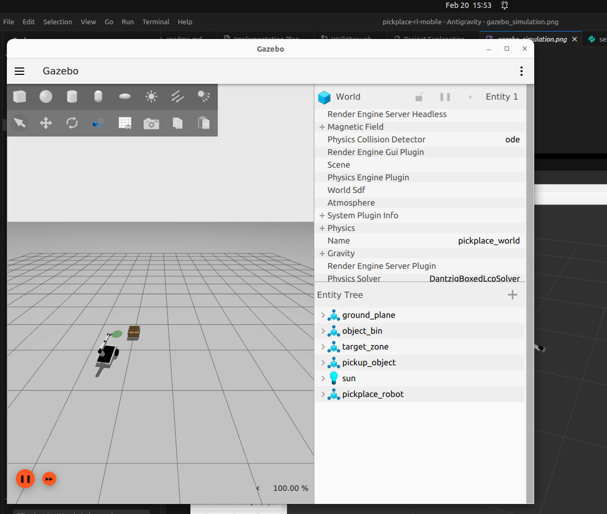

# Pick-and-Place RL Mobile Robot

## Overview
The **Pick-and-Place RL Mobile Robot** is a ROS 2 Jazzy-based project that integrates a mobile robotic base and a 4-DOF robotic arm. The system uses **Reinforcement Learning (RL)** with the SAC (Soft Actor-Critic) algorithm to autonomously pick objects from a bin and place them at a target location.

This project combines multiple robotics concepts:
- Mobile navigation with differential drive
- 4-DOF robotic arm manipulation
- Parallel gripper for grasping
- RGB-D camera perception with HSV color segmentation
- 2D LiDAR for obstacle detection and Nav2 navigation
- RL-based policy learning with Stable-Baselines3
- Real-time safety monitoring with emergency stop
- Domain randomization for sim-to-real transfer
- ROS 2-based modular architecture
- Gazebo Harmonic simulation with physics

The goal is to create an end-to-end autonomous mobile manipulator capable of performing pick-and-place tasks in simulated environments, with a clear path to real-world deployment.

---

## System Architecture Deep-Dive

This section explains how every component of the system works together, from sensors to decision-making.

### Overview

The system follows a **sense-plan-act** architecture. Sensors mounted on the robot (cameras, LiDAR, wheel encoders) feed data through ROS 2 topics to perception and safety nodes. The RL policy node consumes processed perception data and joint state feedback to produce motor commands for both the mobile base and the arm.

```
┌─────────────────────────────────────────────────────────────────┐
│                        Gazebo Harmonic                          │
│  ┌──────────────┐  ┌──────────┐  ┌──────────┐  ┌───────────┐  │
│  │ Diff Drive    │  │ RGB Cam  │  │ Depth Cam│  │ 2D LiDAR  │  │
│  │ /cmd_vel      │  │ /camera/ │  │ /camera/ │  │ /scan     │  │
│  │ /odom         │  │ image_raw│  │ depth    │  │           │  │
│  └──────┬───────┘  └────┬─────┘  └────┬─────┘  └─────┬─────┘  │
│         │               │             │               │        │
│  ┌──────┴───────────────┴─────────────┴───────────────┴─────┐  │
│  │                    ros_gz_bridge                          │  │
│  └──────┬───────────────┬─────────────┬───────────────┬─────┘  │
└─────────┼───────────────┼─────────────┼───────────────┼────────┘
          │               │             │               │
    ┌─────┴─────┐  ┌──────┴─────────────┴───────┐ ┌────┴────────┐
    │  ManipRL  │  │     Perception Node        │ │ Safety Guard│
    │  Node     │←─│  HSV Segmentation          │ │ Joint Limits│
    │  (SAC)    │  │  Depth 3D Projection       │ │ Obstacle    │
    │           │  │  /perception/detected_obj  │ │ E-Stop      │
    └─────┬─────┘  └────────────────────────────┘ └─────────────┘
          │
    ┌─────┴─────┐
    │   Nav2    │
    │  (opt.)   │
    │  AMCL +   │
    │  DWB      │
    └───────────┘
```

### 1. The Robot (URDF)

The robot is described in a single URDF file (`pickplace_mobile_arm.urdf`) and consists of:

**Mobile Base:**
- A rectangular chassis (0.45m x 0.35m) with two driven wheels (differential drive) and aesthetic details like hubcaps and a top panel
- Controlled via `/cmd_vel` (Twist messages) through the Gazebo `DiffDrive` plugin
- Publishes odometry on `/odom` at 50Hz

**4-DOF Robotic Arm:**
- **Shoulder joint** (revolute, Z-axis rotation) — pans the arm left/right
- **Shoulder pitch joint** (revolute, Y-axis) — lifts the arm up/down
- **Elbow joint** (revolute, Y-axis) — bends the forearm
- **Wrist pitch joint** (revolute, Y-axis) — angles the gripper
- Plus a wrist roll joint for rotation
- Each joint has its own Gazebo `JointController` plugin accepting velocity commands

**Parallel Gripper:**
- Two prismatic finger joints that slide in/out along the Y-axis
- Rubber-pad aesthetics on the finger tips
- Controlled by velocity commands for open/close

**Sensors:**
- **RGB Camera** (640x480 @ 30Hz) — mounted on the front of the chassis, angled slightly downward (0.3 rad pitch). Publishes to `/camera/image_raw`
- **Depth Camera** (640x480 @ 15Hz) — co-located with the RGB camera. Publishes to `/camera/depth`. Used for back-projecting 2D detections into 3D world coordinates
- **2D LiDAR** (360 degrees, 640 samples @ 10Hz, 12m range) — mounted on top of the chassis. Publishes to `/scan`. Used for Nav2 costmaps and obstacle avoidance

### 2. Perception Pipeline (`perception_node.py`)

The perception node replaces the hard-coded object positions that the original RL environment used. It runs entirely with NumPy (no OpenCV dependency) and works as follows:

**Step 1: RGB to HSV conversion** — The raw RGB image is converted to HSV color space using a pure NumPy implementation. This makes the detection robust to lighting changes compared to raw RGB thresholding.

**Step 2: Color segmentation** — Two HSV masks are applied to capture red (hue wraps around 0/180 in the HSV space):
- Range 1: H=[0,10], S=[100,255], V=[100,255]
- Range 2: H=[170,180], S=[100,255], V=[100,255]

The union of both masks captures all shades of red.

**Step 3: Blob detection** — All pixels passing the mask are collected. If there are enough (> `min_contour_area` pixels), the centroid is computed as the mean pixel position.

**Step 4: Depth projection** — The depth image around the centroid is sampled in a 10x10 window. The median valid depth (between 5cm and 3m) is used with the pinhole camera model to back-project the 2D detection into 3D camera-frame coordinates:
```
x = (pixel_x - cx) * depth / fx
y = (pixel_y - cy) * depth / fy
z = depth
```

**Step 5: Publish** — The 3D pose is published as a `PoseStamped` on `/perception/detected_object`. A debug image with the detection overlay is published on `/perception/debug_image`. RViz markers highlight the detected object (red sphere) and target zone (green cylinder).

### 3. Safety Guard (`safety_guard.py`)

The safety system runs at 20Hz and enforces multiple constraints:

- **Joint limit monitoring** — Each joint position is compared against its URDF limits with a configurable margin (default 0.1 rad). Warnings are raised as joints approach limits.

- **End-effector workspace** — Forward kinematics computes the EE position. The node checks:
  - EE height > 2cm (prevent ground collision)
  - EE reach < 75cm (prevent overextension)

- **Base workspace** — The base position from odometry must stay within a configurable radius from origin (default 3m).

- **LiDAR obstacle detection** — The minimum range from the `/scan` LaserScan is monitored. If any obstacle is closer than 25cm, a **CRITICAL** emergency stop is triggered — sending zero velocity on `/cmd_vel`.

- **Status publishing** — A JSON status message on `/safety/status` includes severity level, list of violations, EE position, minimum obstacle distance, and e-stop state. The ManipRL node subscribes to this and freezes if e-stop is active.

### 4. RL Environment (`pickplace_env.py`)

The Gymnasium environment wraps the ROS 2 simulation:

**Observation space (16-dim):**
| Index | Content | Purpose |
|-------|---------|---------|
| 0-4 | Joint positions (5 arm joints) | Proprioception |
| 5-7 | End-effector XYZ (local frame) | Arm state |
| 8-10 | Object position XYZ | Task target |
| 11 | Object grasped flag | Task state |
| 12 | Current phase (0-5) | State machine |
| 13-15 | Base pose (x, y, theta) | Navigation |

**Action space (8-dim continuous [-1, 1]):**
| Index | Content | Scale |
|-------|---------|-------|
| 0-4 | Joint velocities | x0.5 rad/s |
| 5 | Gripper command (+open/-close) | binary threshold |
| 6 | Base linear velocity | x0.5 m/s |
| 7 | Base angular velocity | x1.0 rad/s |

**6-Phase state machine:**
The reward function guides the agent through a strict sequence, preventing random thrashing:
1. **Phase 0 - APPROACH**: Navigate base + extend arm towards the object. Reward: dense distance reduction (base + arm + angular alignment)
2. **Phase 1 - LOWER**: Lower the EE to grasp height (7cm). Reward: dense Z-distance
3. **Phase 2 - GRASP**: Close gripper. Reward: +50 when gripper closes
4. **Phase 3 - LIFT**: Raise object to safe transport height (25cm). Reward: dense Z-distance
5. **Phase 4 - MOVE TO TARGET**: Navigate to the target zone. Reward: dense XY-distance
6. **Phase 5 - RELEASE**: Lower to target and open gripper. Reward: +100 for success

**Penalties:**
- -100 instant termination if EE drops below 10cm during unsafe phases
- -0.01 per timestep for joint velocity magnitude (smoothness)

### 5. Manipulation RL Node (`manip_rl_node.py`)

This node wraps the trained SAC policy as a real-time ROS 2 controller:
- Loads a trained `.zip` model from Stable-Baselines3
- Subscribes to `/joint_states`, `/odom`, and `/perception/detected_object`
- Builds the same 16-dim observation vector as the training env
- Runs policy inference at 20Hz
- Publishes the 8-dim action as individual joint velocity commands + base Twist
- Respects safety guard — freezes all outputs if e-stop is active

Key difference from training: instead of using hard-coded `self.object_pos`, it uses the live 3D position from the perception node.

### 6. Domain Randomization (`domain_randomizer.py`)

A utility module that can plug into the training env's `reset()` and `step()` methods to improve sim-to-real transfer:

- **Object position** — Randomized within configurable X/Y ranges around the bin
- **Object size** — Scaled 80%-130% of nominal 4cm cube
- **Object color** — HSV hue shifted around red, with saturation/brightness variation
- **Target position** — Randomized within the target zone area
- **Observation noise** — Gaussian noise on joint positions (0.01 rad std), odom (0.005m std), and heading (0.01 rad std)
- **Action noise** — Small Gaussian perturbation (0.02 std) for robustness
- **Physics** — Mass perturbation, friction variation, gravity noise

All randomization is configurable via `RandomizationConfig` dataclass with per-feature enable flags.

### 7. Nav2 Navigation

The Nav2 stack provides autonomous goal-oriented navigation for the mobile base:

- **Localization (AMCL)** — Adaptive Monte Carlo Localization using the 2D LiDAR to localize on a known map
- **Global planner (NavFn)** — A* or Dijkstra path planning on the global costmap
- **Local controller (DWB)** — Dynamic Window approach for reactive obstacle avoidance, tuned for max 0.3 m/s linear, 1.0 rad/s angular
- **Costmaps** — Local (3m x 3m rolling window) and global costmaps with LiDAR-based obstacle layers and 0.5m inflation radius
- **Recovery behaviors** — Spin, backup, and wait for when the robot gets stuck
- **Launch** — Enabled via `use_nav2:=true` in the full system launch

---

## Previews

### Simulation Environment


### Robot Close-up


---

## Features

### 1. Mobile Manipulator
- Differential drive mobile base with wheel encoders
- 4-DOF robotic arm (shoulder pan, shoulder pitch, elbow, wrist pitch)
- Parallel gripper with prismatic fingers for grasping
- RGB-D camera and 2D LiDAR for perception

### 2. Reinforcement Learning
- **Algorithm**: SAC (Soft Actor-Critic) for continuous control
- **Environment**: Custom Gymnasium environment with ROS 2 integration
- **Observation Space**: Joint positions, end-effector position, object position, grasp state, and current state-machine phase (0-5)
- **Action Space**: Joint velocities + gripper control + base motion
- **State Machine Training**: The agent follows a precise sequence to avoid random thrashing:
   - `APPROACH` -> `LOWER` -> `GRASP` -> `LIFT` -> `MOVE_TO_TARGET` -> `RELEASE`
- **Reward Shaping**:
  - Substantial bonus rewards for transitioning between the specific state phases
  - Dense rewards for minimizing distance to the current phase goal
  - Heavy collision penalty: end episodes immediately with massive penalty if reaching too low
  - Smoothness penalty: encourages smooth motions

### 3. Simulation
- **Gazebo Harmonic**: Full physics simulation
- **World**: Custom environment with object bin and target zone
- **Plugins**: Differential drive controller, camera sensor, depth camera, LiDAR, joint state publisher
- **Pickable Objects**: Dynamic cubes for pick-and-place tasks

---

## Directory Structure

```
pickplace-rl-mobile/
├── images/                          # Screenshots and media
├── rl_models/                       # Saved RL model checkpoints
├── rviz/                            # RViz configuration files
├── src/pickplace_rl_mobile/
│   ├── config/
│   │   ├── training_config.yaml     # RL hyperparameters
│   │   └── nav2_params.yaml         # Nav2 navigation config
│   ├── launch/
│   │   ├── display_launch.py        # RViz visualization
│   │   ├── gazebo_launch.py         # Gazebo-only simulation
│   │   ├── full_system.launch.py    # Full system launch
│   │   └── standalone_rl_training.launch.py
│   ├── pickplace_rl_mobile/
│   │   ├── perception_node.py       # RGB-D object detection
│   │   ├── safety_guard.py          # Safety monitoring + e-stop
│   │   ├── manip_rl_node.py         # RL policy inference node
│   │   ├── domain_randomizer.py     # Sim-to-real randomization
│   │   ├── pickplace_env.py         # Gymnasium RL environment
│   │   ├── train_rl.py              # RL training script
│   │   ├── test_policy.py           # Policy evaluation
│   │   ├── smart_pick_place.py      # Scripted IK pick-and-place
│   │   └── demo_pick_place.py       # Simple demo
│   ├── urdf/
│   │   └── pickplace_mobile_arm.urdf
│   ├── worlds/
│   │   └── pickplace_world.world
│   ├── setup.py
│   └── package.xml
└── README.md
```

---

## Prerequisites

### System Requirements
- **OS**: Ubuntu 22.04 or later
- **ROS 2**: Jazzy Jalisco
- **Gazebo**: Gazebo Harmonic (Sim)
- **Python**: 3.10+

### ROS 2 Dependencies
```bash
sudo apt update
sudo apt install -y \
  ros-jazzy-gazebo-ros-pkgs \
  ros-jazzy-ros-gz-sim \
  ros-jazzy-ros-gz-bridge \
  ros-jazzy-robot-state-publisher \
  ros-jazzy-joint-state-publisher \
  ros-jazzy-joint-state-publisher-gui \
  ros-jazzy-rviz2 \
  ros-jazzy-xacro \
  ros-jazzy-navigation2 \
  ros-jazzy-nav2-bringup
```

### Python Dependencies
```bash
pip install gymnasium stable-baselines3 torch numpy
```

---

## Installation and Build

### 1. Clone the Repository
```bash
cd ~/
git clone https://github.com/darshmenon/pickplace-rl-mobile.git
cd pickplace-rl-mobile
```

### 2. Build the Workspace
```bash
colcon build --packages-select pickplace_rl_mobile
source install/setup.bash
```

### 3. Verify Installation
```bash
ros2 pkg list | grep pickplace_rl_mobile
```

---

## Usage

### Full System Launch
Launch everything (Gazebo + perception + safety guard):
```bash
source install/setup.bash
ros2 launch pickplace_rl_mobile full_system.launch.py
```

### With Nav2 Navigation
```bash
ros2 launch pickplace_rl_mobile full_system.launch.py use_nav2:=true
```

### With Trained RL Policy
```bash
ros2 launch pickplace_rl_mobile full_system.launch.py use_rl:=true model_path:=./rl_models/pickplace_final_model.zip
```

### Gazebo Only (No Perception)
```bash
ros2 launch pickplace_rl_mobile gazebo_launch.py
```

### Visualization in RViz
View the robot model interactively:
```bash
source install/setup.bash
ros2 launch pickplace_rl_mobile display_launch.py
```

---

## Training the RL Agent

### Quick Start Training
Train for 100k timesteps:
```bash
source install/setup.bash

# In terminal 1: Launch Gazebo
ros2 launch pickplace_rl_mobile gazebo_launch.py

# In terminal 2: Start training
ros2 run pickplace_rl_mobile train_rl --timesteps 100000 --save-dir ./rl_models
```

### Training Parameters
| Parameter | Default | Description |
|-----------|---------|-------------|
| `--timesteps` | 100,000 | Total training steps |
| `--save-dir` | `./rl_models` | Model checkpoint directory |

### Monitoring Training
```bash
tensorboard --logdir ./rl_models/tensorboard
```

Checkpoints saved every 10,000 steps. Evaluation runs every 5,000 steps.

---

## Testing the Trained Policy

After training, test the learned policy:
```bash
source install/setup.bash

# Launch Gazebo
ros2 launch pickplace_rl_mobile gazebo_launch.py

# In another terminal, test the policy
ros2 run pickplace_rl_mobile test_policy --model ./rl_models/pickplace_final_model.zip --episodes 5
```

The test script records camera snapshots and prints success rate + average reward.

---

## Checking Topics

After launching the full system, verify sensor data:
```bash
ros2 topic list | grep -E "camera|scan|perception|safety"
```

### Expected Topics

| Topic | Type | Source |
|-------|------|--------|
| `/camera/image_raw` | `sensor_msgs/Image` | RGB camera |
| `/camera/depth` | `sensor_msgs/Image` | Depth camera |
| `/scan` | `sensor_msgs/LaserScan` | 2D LiDAR |
| `/perception/detected_object` | `geometry_msgs/PoseStamped` | Perception node |
| `/perception/debug_image` | `sensor_msgs/Image` | Perception node |
| `/perception/markers` | `visualization_msgs/Marker` | Perception node |
| `/safety/status` | `std_msgs/String` | Safety guard |
| `/odom` | `nav_msgs/Odometry` | Diff drive |
| `/joint_states` | `sensor_msgs/JointState` | Joint state publisher |
| `/cmd_vel` | `geometry_msgs/Twist` | Base velocity |

---

## Configuration

### Training Hyperparameters
Edit `config/training_config.yaml`:
- Learning rate, buffer size, batch size
- Reward weights and episode length
- Algorithm parameters

### Nav2 Navigation
Edit `config/nav2_params.yaml`:
- AMCL localization parameters
- DWB controller speeds and acceleration limits
- Costmap resolution and obstacle detection settings

### Robot Model
Modify `urdf/pickplace_mobile_arm.urdf`:
- Link dimensions and joint limits
- Sensor parameters (camera resolution, LiDAR range)
- Inertial properties

### Gazebo World
Edit `worlds/pickplace_world.world`:
- Object bin position and size
- Target zone location
- Lighting and physics settings

---

## Results

### Training Performance
- **Algorithm**: SAC (Soft Actor-Critic)
- **Training Duration**: ~100k timesteps
- **Training Time**: ~2-4 hours (GPU recommended)
- **Success Rate**: 60-80% after full training

---

## Troubleshooting

### Build Issues
| Error | Solution |
|-------|----------|
| `Package not found` | Run `source install/setup.bash` |
| `CMake Error: ament_cmake` | `sudo apt install ros-jazzy-ament-cmake` |

### Gazebo Issues
| Error | Solution |
|-------|----------|
| Gazebo doesn't start | Check `gz sim --version` and ROS bridge |
| Robot falls through ground | Increase physics step size or check collision geometry |
| No camera/lidar data | Verify bridge topics with `ros2 topic list` |

### Training Issues
| Error | Solution |
|-------|----------|
| `ModuleNotFoundError: gymnasium` | `pip install gymnasium stable-baselines3` |
| Training crashes | Reduce learning rate, increase buffer size |
| NaN rewards | Check physics settings and reward function |

---

## Roadmap

- [x] Mobile base with differential drive
- [x] 4-DOF robotic arm with parallel gripper
- [x] SAC-based RL training pipeline
- [x] RGB-D camera perception pipeline
- [x] 2D LiDAR for obstacle detection
- [x] Safety guard with emergency stop
- [x] Nav2 navigation stack integration
- [x] Domain randomization for sim-to-real
- [ ] Real robot deployment (Jetson + RealSense)
- [ ] Multi-object sorting with color classification
- [ ] MoveIt2 integration for motion planning
- [ ] Sim-to-real transfer validation

---

## License
MIT License

## Maintainer
**Darsh Menon**
- Email: darshmenon02@gmail.com
- GitHub: [@darshmenon](https://github.com/darshmenon)

---

## Acknowledgments
- [ROS 2](https://docs.ros.org/) community for excellent documentation
- [Stable-Baselines3](https://stable-baselines3.readthedocs.io/) for RL implementations
- [Gazebo](https://gazebosim.org/) simulation framework
- [Nav2](https://docs.nav2.org/) for navigation stack
- [OpenAI Gymnasium](https://gymnasium.farama.org/) for environment interface

---

## Citation
```bibtex
@software{pickplace_rl_mobile,
  author = {Menon, Darsh},
  title = {Pick-and-Place RL Mobile Manipulator},
  year = {2025},
  url = {https://github.com/darshmenon/pickplace-rl-mobile}
}
```
